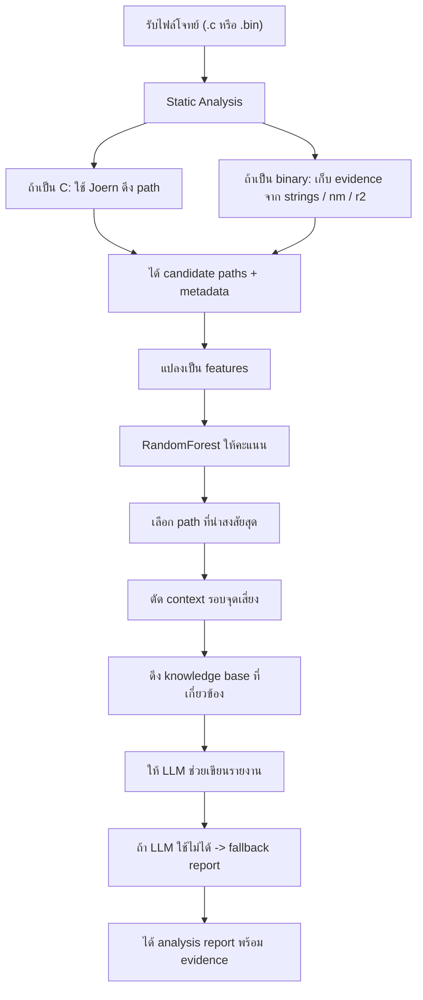
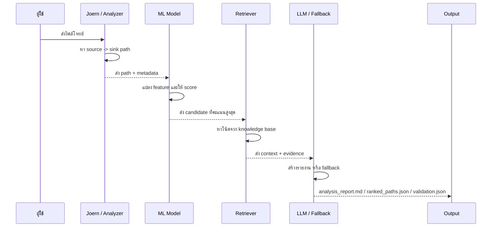

# Hybrid Vulnerability Analysis Demo

โปรเจกต์นี้คือเดโม่แนวคิด "เอาหลายอย่างมาช่วยกันหาช่องโหว่" ไม่ได้พึ่งแค่ static analysis อย่างเดียว และก็ไม่ได้โยนโค้ดทั้งก้อนไปให้ LLM ตอบมั่ว ๆ

ไอเดียหลักของโปรเจกต์นี้คือ:

1. เอาไฟล์ C หรือ binary เข้ามาวิเคราะห์
2. หา path ที่น่าสงสัย เช่น input จากข้างนอกไหลไปหาฟังก์ชันอันตราย
3. แปลง path เหล่านั้นเป็น feature ตัวเลข
4. ให้ model ช่วยจัดอันดับว่า path ไหนน่าจะเป็นของจริง
5. ตัด context เฉพาะช่วงที่เสี่ยง
6. ดึงความรู้จาก knowledge base มาช่วยประกอบ
7. ให้ LLM ช่วยเขียนสรุปรายงานแบบอ่านง่าย

พูดง่าย ๆ คือโปรเจกต์นี้พยายามทำให้การไล่ bug ไม่ต้องเริ่มจากศูนย์ทุกครั้ง

## ตอนนี้โปรเจกต์ทำอะไรได้แล้ว

- ใช้ `Joern` จริงในการดึง path จากไฟล์ C
- มี fallback analyzer เผื่อวันที่เครื่องไม่มี `Joern`
- วิเคราะห์ `.bin` แบบเสริมหลักฐานด้วย `strings`, `nm`, `otool`, `radare2`
- มี ML model ช่วยให้คะแนน path
- มีการตัด code window รอบบรรทัดที่เสี่ยง
- มี knowledge base แบบง่าย ๆ ไว้ช่วยอธิบายโจทย์
- มี LLM report stage
- ถ้า LLM ใช้ไม่ได้ ระบบจะ fallback ไปสร้างรายงาน heuristic ให้แทน

## โครงสร้างโปรเจกต์

- `samples/` เก็บไฟล์โจทย์ที่เอาไว้ลอง
- `data/training_paths.csv` dataset เล็กสำหรับ train model
- `data/knowledge_base/` โน้ตความรู้ที่เอาไว้ทำ retrieval
- `scripts/pipeline.py` ตัว pipeline หลัก
- `scripts/joern_extract.sc` สคริปต์ query ของ `Joern`
- `outputs_source_joern/` ผลลัพธ์รอบที่ใช้ `Joern` จริง
- `outputs_binary/` ผลลัพธ์รอบวิเคราะห์ binary

## ภาพรวมการไหลของระบบ



## มองแบบทีละชั้น



## ไฟล์สำคัญที่ควรรู้จัก

- `scripts/pipeline.py`
  ตัวหลักของระบบ ตั้งแต่ parse -> score -> retrieve -> report

- `scripts/joern_extract.sc`
  query script ที่ใช้กับ `Joern` จริง

- `samples/command_injection_challenge.c`
  sample โจทย์ C สำหรับเดโม่

- `outputs_source_joern/ranked_paths.json`
  ผล path ranking จากรอบที่ใช้ `Joern`

- `outputs_source_joern/analysis_report.md`
  รายงานสรุปที่ระบบสร้างออกมา

## ตอนนี้เดโม่เจออะไร

จาก sample ปัจจุบัน ระบบเจอ path นี้:

- source คือ `fgets`
- sink คือ `system`
- อยู่ที่บรรทัด `29 -> 45`
- ถูกมองว่าเป็น command injection style flow

สรุปสั้น ๆ คือ input จากผู้ใช้ไหลเข้าไปสร้าง command แล้วไปเรียก `system()` ต่อ

## วิธีรัน

### 1. เปิด virtualenv

```bash
cd hybrid-vuln-analysis-demo
python3 -m venv .venv
source .venv/bin/activate
pip install -r requirements.txt
```

### 2. รันกับ source code

```bash
python3 scripts/pipeline.py --sample samples/command_injection_challenge.c --outputs outputs_source_joern
```

### 3. รันกับ binary

```bash
python3 scripts/pipeline.py --sample samples/command_injection_challenge.bin --mode binary --outputs outputs_binary
```

## Output ที่จะได้

- `ranked_paths.json`
  รายการ path ที่เจอ พร้อมคะแนนและ metadata

- `features_scored.csv`
  ตาราง feature ที่เอาเข้า model

- `context_window.txt`
  โค้ดหรือ evidence เฉพาะช่วงที่เสี่ยง

- `retrieved_context.json`
  โน้ตจาก knowledge base ที่ระบบดึงมาใช้

- `analysis_report.md`
  รายงานสรุปแบบอ่านง่าย

- `validation.json`
  บอกว่า LLM stage ผ่านไหม หรือ fallback เพราะอะไร

- `binary_corroboration.json`
  หลักฐานฝั่ง binary ที่ช่วยยืนยันผลจาก source
